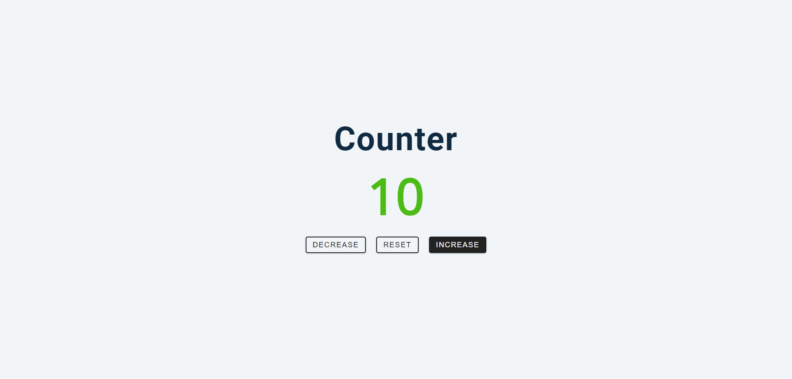

# Counter
Hi, this repository contains a simple Counter web application created using HTML, CSS, and JavaScript. The Counter App allows users to increment, decrement, and reset a counter value through a user-friendly interface. This project is ideal for learning and demonstrating basic DOM manipulation and event handling in JavaScript.

## [Live Preview](https://the-counter-js.netlify.app/)

Built with:

  

## Output:

